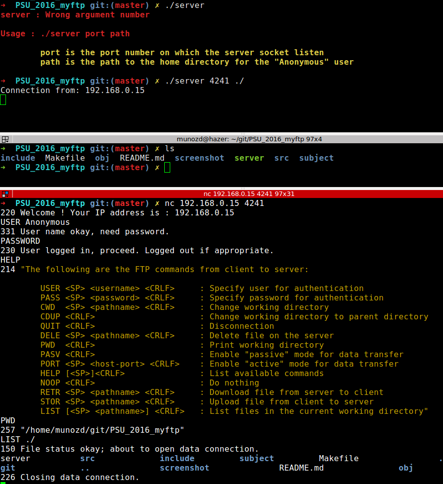

# PSU_2016_myftp
Epitech second year project : [PSU] PSU_2016_myftp

First UNIX-netork module project

Deadline : 2 weeks

Beginning of the project : 08/05/2017, 07h42

Group size : 1 person

# myFTP

The purpose of this project is to create a FTP server.

* [FTP](https://en.wikipedia.org/wiki/File_Transfer_Protocol)

## Getting started

These instructions will allow you to obtain a copy of the operational project on your local machine for development and testing purposes.

### Prerequisites

What do you need to install the software and how to install it?

```
gcc
netcat (as client)
make
```

### Installation

Here's how to start the project on your computer

Clone and go in the directory PSU_2016_myftp

Project compilation

```
make
```

Running project

```
./server port path
```


## Screenshot



## Build with

* [C](https://en.wikipedia.org/wiki/C_(programming_language))

## Auteurs

* **David Munoz** - [DavidMunoz-dev](https://github.com/davidmunoz-dev)
